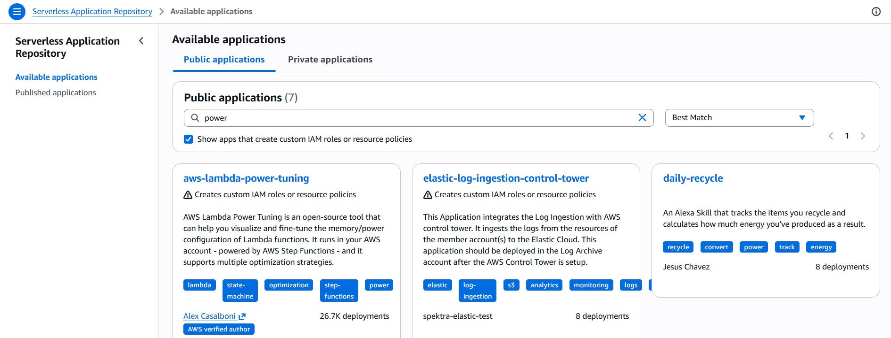
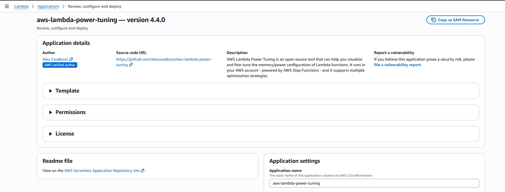
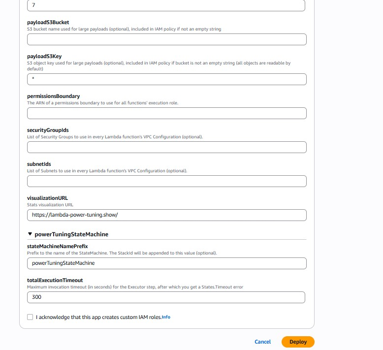
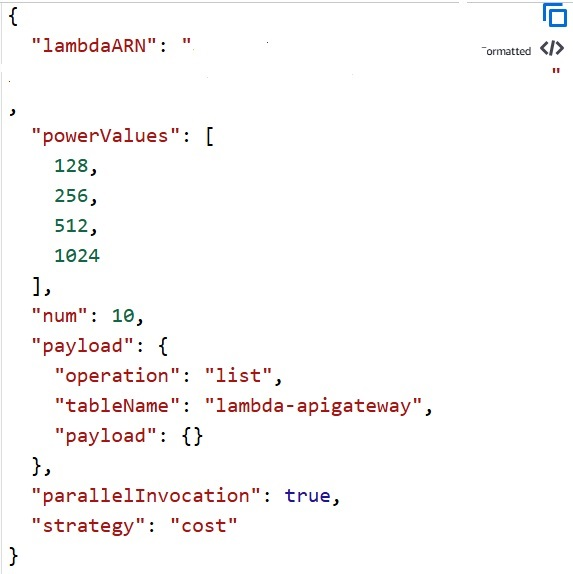
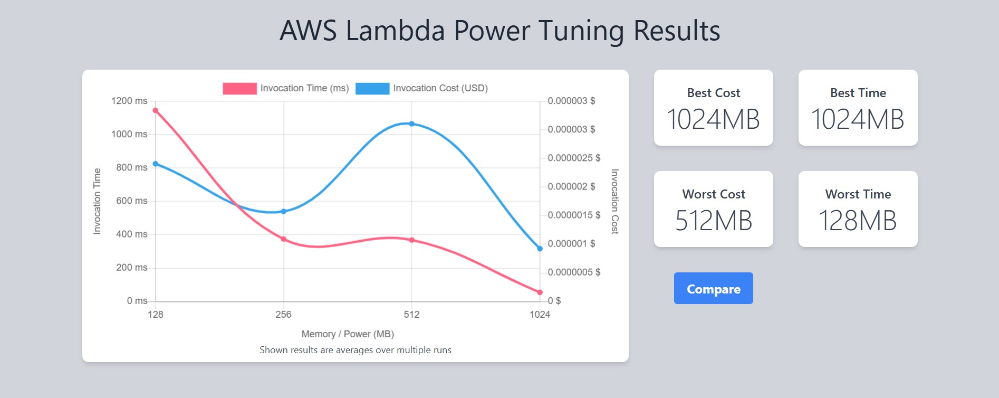
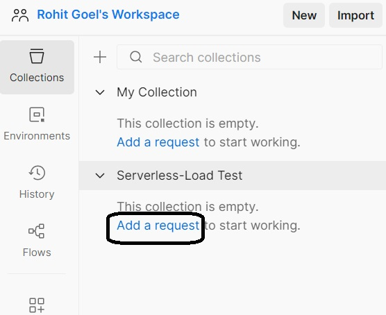
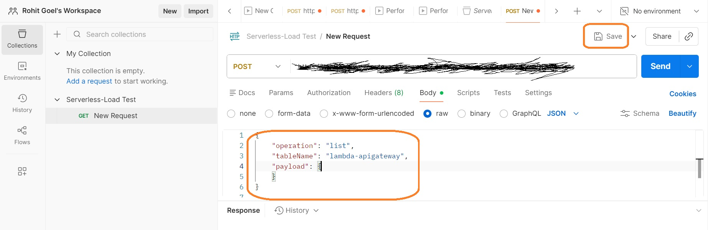
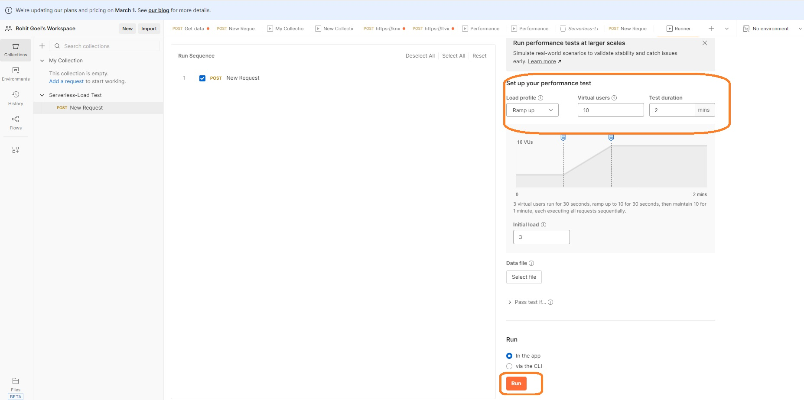

# serverless-powertuning

## Architecture Overview And High Level Design

Let's start with the High Level Design.

An Amazon API Gateway is a collection of resources and methods. For this architecture, you need to create one resource (DynamoDBManager) and define one method (POST) on it. The method is backed by a Lambda function (LambdaFunctionOverHttps). That is, when you call the API through an HTTPS endpoint, Amazon API Gateway invokes the Lambda function.

The POST method on the DynamoDBManager resource supports the following DynamoDB operations:

* Create, update, and delete an item.
* Read an item.
* Scan an item.
* Other operations (echo, ping), not related to DynamoDB, that you can use for testing.

The request payload you send in the POST request identifies the DynamoDB operation and provides necessary data. For example:

The following is a sample request payload for a DynamoDB create item operation:

```json
{
    "operation": "create",
    "tableName": "lambda-apigateway",
    "payload": {
        "Item": {
            "id": "1",
            "name": "Bob"
        }
    }
}
```
The following is a sample request payload for a DynamoDB read item operation:
```json
{
    "operation": "read",
    "tableName": "lambda-apigateway",
    "payload": {
        "Key": {
            "id": "1"
        }
    }
}
```

## Once reources created, we will run Lambda Power tuning (AWS Step Functions) to find optimal Memory based on required AWS Well Architected Framwork Pillar Cost Optimisation and Performance Efficiency or a balanced approach.
## Then we will trigger a Performance test with 10 Virtual Users using Postman Collection Runners to trigger POST APIs for 2 mins with Lambda Memory configuration 128 MB and 1024 MB and will compare the latency and throughput 

## Setup

### Create Custom Policy 

We need to create a custom policy for least privilege

1. Open policies page in the IAM console
2. Click "Create policy" on top right corner
3. In the policy editor, click JSON, and paste the following 


```json
{
    "Version": "2012-10-17",
    "Statement": [
    {
      "Sid": "Stmt1428341300017",
      "Action": [
        "dynamodb:DeleteItem",
        "dynamodb:GetItem",
        "dynamodb:PutItem",
        "dynamodb:Query",
        "dynamodb:Scan",
        "dynamodb:UpdateItem"
      ],
      "Effect": "Allow",
      "Resource": "*"
    },
    {
      "Sid": "",
      "Resource": "*",
      "Action": [
        "logs:CreateLogGroup",
        "logs:CreateLogStream",
        "logs:PutLogEvents"
      ],
      "Effect": "Allow"
    }
    ]
    }
```
4. Give name "lambda-custom-policy", and click "Create policy" on botom right

### Create Lambda IAM Role 

Create the execution role that gives your function permission to access AWS resources.

To create an execution role

1. Open the roles page in the IAM console.
2. Choose Create role.
3. Create a role with the following properties.
    * Trusted entity type – AWS service, then select Lambda from Use case
    * Permissions – In the Permissions policies page, in the search bar, type lambda-custom-policy. The newly created policy should show up. Select it, and click Next.

    

    * Role name – **lambda-apigateway-role**.
    * Click "Create role"


### Create Lambda Function

**To create the function**
1. Click "Create function" in AWS Lambda Console


2. Select "Author from scratch". Use name **LambdaFunctionOverHttps** , select **Python 3.13** as Runtime. Under Permissions, click the arrow beside "Change default execution role", then "use an existing role" and select **lambda-apigateway-role** that we created, from the drop down

3. Click "Create function"


4. Replace the boilerplate coding with the following code snippet and click "Deploy"

**Example Python Code**
```python
from __future__ import print_function
import boto3
import json

print('Loading function')


def lambda_handler(event, context):
    '''Provide an event that contains the following keys:

      - operation: one of the operations in the operations dict below
      - tableName: required for operations that interact with DynamoDB
      - payload: a parameter to pass to the operation being performed
    '''
    #print("Received event: " + json.dumps(event, indent=2))

    operation = event['operation']

    if 'tableName' in event:
        dynamo = boto3.resource('dynamodb').Table(event['tableName'])

    operations = {
        'create': lambda x: dynamo.put_item(**x),
        'read': lambda x: dynamo.get_item(**x),
        'update': lambda x: dynamo.update_item(**x),
        'delete': lambda x: dynamo.delete_item(**x),
        'list': lambda x: dynamo.scan(**x),
        'echo': lambda x: x,
        'ping': lambda x: 'pong'
    }

    if operation in operations:
        return operations[operation](event.get('payload'))
    else:
        raise ValueError('Unrecognized operation "{}"'.format(operation))
```


### Test Lambda Function

Let's test our newly created function. We haven't created DynamoDB and the API yet, so we'll do a sample echo operation. The function should output whatever input we pass.
1. Click the "Test" tab right beside "Code" tab

2. Give "Event name" as echotest

3. Paste the following JSON into the event. The field "operation" dictates what the lambda function will perform. In this case, it'd simply return the payload from input event as output. Click "Save" to save
```json
{
    "operation": "echo",
    "payload": {
        "somekey1": "somevalue1",
        "somekey2": "somevalue2"
    }
}
```
3. Click "Test", and it will execute the test event. You should see the output in the console


We're all set to create DynamoDB table and an API using our lambda as backend!

### Create DynamoDB Table

Create the DynamoDB table that the Lambda function uses.

**To create a DynamoDB table**

1. Open the DynamoDB console.
2. Choose "tables" from left pane, then click "Create table" on top right.
3. Create a table with the following settings.
   * Table name – lambda-apigateway
   * Partition key – id (string)
4. Choose "Create table".


### Create API

**To create the API**
1. Go to API Gateway console
2. Click Create API
3. Scroll down and select "Build" for REST API
4. Give the API name as "DynamoDBOperations", keep everything as is, click "Create API"


5. Each API is collection of resources and methods that are integrated with backend HTTP endpoints, Lambda functions, or other AWS services. Typically, API resources are organized in a resource tree according to the application logic. At this time you only have the root resource, but let's add a resource next. Click "Create Resource"

6. Input "DynamoDBManager" in the Resource Name. Click "Create Resource"


7. Let's create a POST Method for our API. With the "/dynamodbmanager" resource selected, click "Create Method". 


8. Select "POST" from drop down.

9. Integration type should be pre-selected as "Lambda function". Select "LambdaFunctionOverHttps" function that we created earlier. As you start typing the name, your function name will show up.Select the function, scroll down and click "Create method". 


Our API-Lambda integration is done!

### Deploy the API

In this step, you deploy the API that you created to a stage called prod.

1. Click "Deploy API" on top right

2. Now it is going to ask you about a stage. Select "[New Stage]" for "Stage". Give "Prod" as "Stage name". Click "Deploy"


3. We're all set to run our solution! To invoke our API endpoint, we need the endpoint url. In the "Stages" screen, expand the stage "Prod", keep expanding till you see "POST", select "POST" method, and copy the "Invoke URL" from screen


### Running our solution

1. The Lambda function supports using the create operation to create an item in your DynamoDB table. To request this operation, use the following JSON:

```json
{
    "operation": "create",
    "tableName": "lambda-apigateway",
    "payload": {
        "Item": {
            "id": "1234ABCD",
            "number": 5
        }
    }
}
```
2. To execute our API from local machine, we are going to use Postman and Curl command. You can choose either method based on your convenience and familiarity. 
    * To run this from Postman, select "POST" , paste the API invoke url. Then under "Body" select "raw" and paste the above JSON. Click "Send". API should execute and return "HTTPStatusCode" 200.

    

    * To run this from terminal using Curl, run the below
    ```
    $ curl -X POST -d "{\"operation\":\"create\",\"tableName\":\"lambda-apigateway\",\"payload\":{\"Item\":{\"id\":\"1\",\"name\":\"Bob\"}}}" https://$API.execute-api.$REGION.amazonaws.com/prod/DynamoDBManager
    ```   
3. To validate that the item is indeed inserted into DynamoDB table, go to Dynamo console, select "lambda-apigateway" table, select "Explore table items" button from top right, and the newly inserted item should be displayed.


4. To get all the inserted items from the table, we can use the "list" operation of Lambda using the same API. Pass the following JSON to the API, and it will return all the items from the Dynamo table

```json
{
    "operation": "list",
    "tableName": "lambda-apigateway",
    "payload": {
    }
}
```


We have successfully created a serverless API using API Gateway, Lambda, and DynamoDB!

###  AWS Lambda Power Tuning

 AWS Lambda Power Tuning is a open-source tool which is actually a state machine powered by AWS Step Functions that helps you optimize your Lambda functions for cost and/or performance in a data-driven way.
 This is used to determine optimal memory to allocate to Lambda based on the goal i.e. best performance, or cheapest cost, or a balance etc.

### SetUp Lambda Power Tuning

1. Go to Serverless Application Repository
2. Click Available Applications, type “power”.
 

3. Select aws-lambda-power-tuning and deploy

  
  
 

## Execute Power Tuning for Lambda 

Execute Power Tuning(Step Function) with below input that will execute lambda with different memory combinations from 128 Mb to 1024 Mb



 ```json
{
  "lambdaARN": "PUT YOUR LAMBDA ARN HERE",
  "powerValues": [
    128,
    256,
    512,
    1024
  ],
  "num": 10,
  "payload": {
    "operation": "list",
    "tableName": "lambda-apigateway",
    "payload": {}
  },
  "parallelInvocation": true,
  "strategy": "cost"
}
```

## Below will be the output of execution which will give graph showing average duration (per invocation) and average cost (per invocation) for multiple memory invocations



##  Performance & Cost Observations

| Memory | Avg Duration | Cost per Invoke | Behavior | Outcome |
|---:|---:|---:|---|---|
| 128 MB | ~1146 ms | ~0.00000241 | CPU constrained, high latency |  Avoid |
| 256 MB | ~374 ms | ~0.00000158 | Better Cost and latency vs 128 MB |  Better than 128 Mb |
| 512 MB | ~369 ms | ~0.00000311 | No benefit vs 256 MB; cost and Duration ↑ |  Worst Cost and Time |
| **1024 MB** | **~55ms ms** | **~0.00000092** | Fastest & stable under load |  **Best Performance Profile** |

**Conclusion:**  
For this workload, **1024 MB** offers the best **latency consistency + throughput** with **lowest total execution cost**.


##  Load Testing with Postman Collections Runner 

You can run LoadTest the microservice(serverless or no serverless) and get performance report using Postman Collections Runner. Here we will use to it to perform load test on our serverless Microservice by sending API requests as per Strategy like RampUp which will be similar to API requests sent by Virtual Users.
We will perform this load test with Lambda Memory 128 MB and 1024 MB to see latency changes.
These requests will hit APIGateway and then reach to Lambda for processing and then to DynamoDB and return the return back.
The Collection Runner logs the test results for each request, and it can use scripts to pass data between requests and change the request workflow.
This will be very useful to determine the latency and we will check how increasing memory can impact this latency.

## SetUp Postman Collection Run Configuration (This requires Postman Desktop Application)

1. Open Postman Application on your desktop.
2. Under Collections , Create a New Collection and rename it . then click on Add a Request.

    

3. Change GET to POST method in New Request and Add Lambda ARN APIgatway POST invoke url .
4. Provide below POST payload in request body and paste it

    


 ```json
   {
    "operation": "list",
    "tableName": "lambda-apigateway",
    "payload": {
    }
  }
```

5.    Run the Collection with “Ramp up” under Load Profile, select “10” in Virtual users, and Test duration as 2 mins
 Note: 10 here is for concurrency limit available for lambda. if number is higher than lambda concurrency limit, API requests will fail with error "Too Many Requests"
    


Let it run for 2 mins. It will generate a pdf report which can be downloaded .

##  Workload Behavior Observation (Postman Load Testing)

| Memory | Avg Latency | P90 | P95 | P99 | Errors | Result |
|---:|---:|---:|---:|---:|---:|---|
| 128 MB | ~900 ms | ~1128 ms | ~1194 ms | ~1446 ms | 0% |  High Latency under Load |
| **1024 MB** | **~70–90 ms** | **~90 ms** | **~105 ms** | **~160 ms** | **0%** |  **Stable & scalable** |


## Cleanup

Let's clean up the resources we have created for this lab.


### Cleaning up DynamoDB

To delete the table, from DynamoDB console, select the table "lambda-apigateway", then on top right , click "Actions", then "Delete table"

To delete the Lambda, from the Lambda console, select lambda "LambdaFunctionOverHttps", click "Actions", then click Delete 

To delete the API we created, in API gateway console, under APIs, select "DynamoDBOperations" API, click "Delete"

